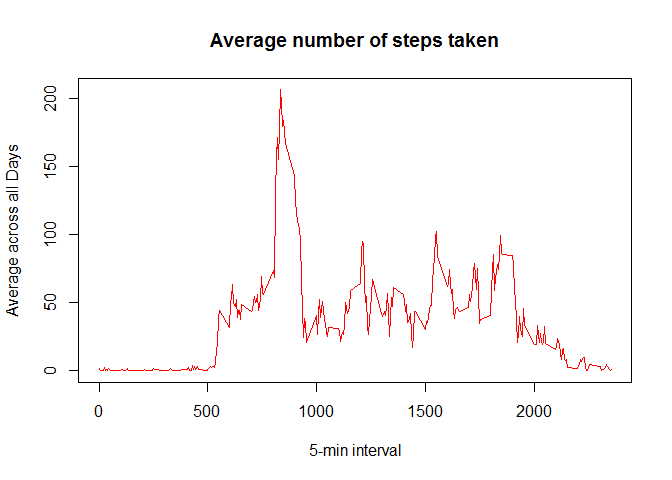

# Reproducible assignment

```r
library(lattice)
library(knitr)
```

```
## Warning: package 'knitr' was built under R version 3.2.3
```

```r
opts_chunk$set(echo = TRUE , results = "hold")
```

###Loading and preprocessing the data


```r
activitydata<- read.csv('activity.csv', header = TRUE, sep = ",",
                        colClasses=c("numeric", "character", "numeric"))
activitydata$date <- as.Date(activitydata$date, "%Y-%m-%d")
```
###What is mean total number of steps taken per day?


```r
Totalsteps<- aggregate(steps ~ date, data = activitydata, sum, na.rm = TRUE)
```
**Calculating Mean and Median**

```r
mean(Totalsteps$steps)
median(Totalsteps$steps)
```

```
## [1] 10766.19
## [1] 10765
```
###What is the average daily activity pattern?
**Time Series Plot**

```r
time_series <- tapply(activitydata$steps, activitydata$interval, mean, na.rm = TRUE)
plot(row.names(time_series), time_series, type = "l", xlab = "5-min interval", 
     ylab = "Average across all Days", main = "Average number of steps taken", 
     col = "red")
```

\

**Which 5-minute interval, on average across all the days in the dataset, contains the maximum number of steps?**

```r
max_interval <- which.max(time_series)
names(max_interval)
```

```
## [1] "835"
```
###Inputting missing values
**Total number of missing values in the dataset**   

```r
activity_NA <- sum(is.na(activitydata))
activity_NA
```

```
## [1] 2304
```
**Strategy for filling in all of the missing values in the dataset**

```r
StepsAverage <- aggregate(steps ~ interval, data = activitydata, FUN = mean)
fillNA <- numeric()
for (i in 1:nrow(activitydata)) {
  obs <- activitydata[i, ]
  if (is.na(obs$steps)) {
    steps <- subset(StepsAverage, interval == obs$interval)$steps
  } else {
    steps <- obs$steps
  }
  fillNA <- c(fillNA, steps)
}  
```
**Create a new dataset that is equal to the original dataset but with the missing data filled in.** 

```r
new_activity <- activitydata
new_activity$steps <- fillNA
```
**Histogram of the total number of steps taken each day** 

```r
Totalsteps_new <- aggregate(steps ~ date, data = new_activity, sum, na.rm = TRUE)
hist(Totalsteps_new$steps, main = "Total steps by day", xlab = "day", col = "red")
```

\

**Calculating Mean and Median for the new dataset**

```r
mean(Totalsteps_new$steps)

median(Totalsteps_new$steps)
```

```
## [1] 10766.19
## [1] 10766.19
```

###What is the impact of imputing missing data on the estimates of the total daily number of steps?
**we observe that after replacing the mean is the same but the median is different**

###Are there differences in activity patterns between weekdays and weekends?

```r
day <- weekdays(activitydata$date)
daylevel <- vector()
for (i in 1:nrow(activitydata)) {
  if (day[i] == "Saturday") {
    daylevel[i] <- "Weekend"
  } else if (day[i] == "Sunday") {
    daylevel[i] <- "Weekend"
  } else {
    daylevel[i] <- "Weekday"
  }
}
activitydata$daylevel <- daylevel
activitydata$daylevel <- factor(activitydata$daylevel)

stepsByDay <- aggregate(steps ~ interval + daylevel, data = activitydata, mean)
names(stepsByDay) <- c("interval", "daylevel", "steps")
xyplot(steps ~ interval | daylevel, stepsByDay, type = "l", layout = c(1, 2), 
       xlab = "Interval", ylab = "Number of steps")
```

\

**We can see at the graph above that activity on the weekday has the greatest peak from all steps intervals.**
